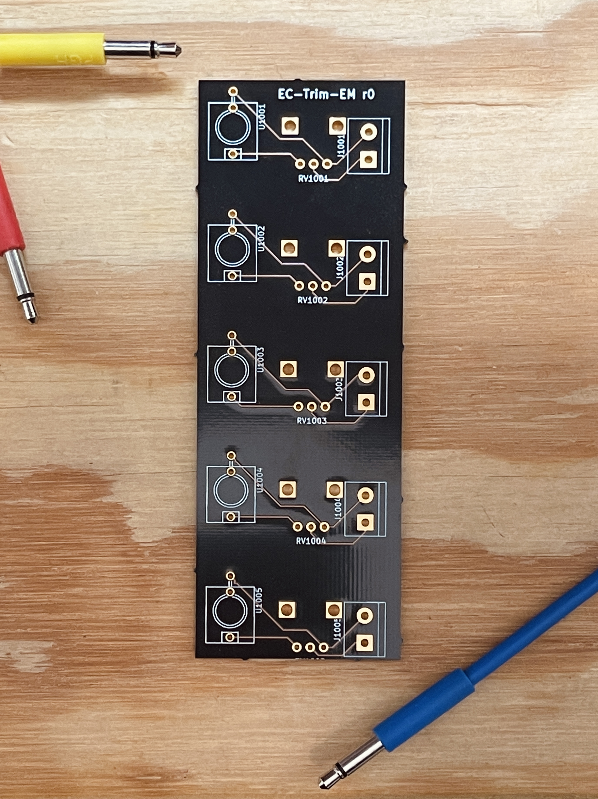
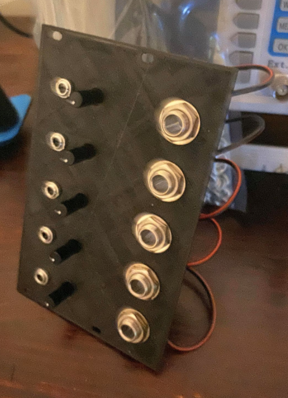

## open-euro-converter

__euro-converter__ is a 12hp eurorack module for interfacing multiple eurorack modular synth signals with traditional audio equipment that wants 1/4" TS inputs. Each of its five channels features an inline potentiometer for attenuating the signal from eurorack-levels to studio-levels. Since euro-converter is completely passive, it also works in reverse to easily bring 1/4" outputs into 3.5mm eurorack-friendly inputs!

## What's included
* __bom.xlsx__ - The bill of materials lists the components (other than the PCB and faceplate) you'll need to fabricate one yourself.
* __kicad__ - The original project files, if you want to tweak euro-converter to your liking.
* __GERBERS__ - The GERBER files to send to the PCB fab ([OshPark is good!](https://oshpark.com/)), if you like euro-converter the way it is.
* __3d__ - STL files to 3D-print a faceplate. There's a complete model as well as one split into two pieces for use with printers featuring smaller build stages.

## Instructions

#### Get your hands on the components

Walk through the process at OshPark (or your fab of choice) with the included GERBER files to get the PCB ordered. While you're waiting on the PCB fairy to visit, order the components from __bom.xlsx__ and print out/acquire a faceplate.

#### Place PCB components

Before you heat up the iron, place the 3.5mm jacks and pots on the board and put the faceplate over them. We want to make sure the faceplate fits while the components can still wiggle around a bit.

#### Solder PCB components

Now that everything's snug, solder your 3.5mm jacks, pots, and terminals to the board. Jacks and pots on the front, terminals on the back.

#### Solder wires to your 1/4" jacks

This is easier to do without having them attached to anything. For the wires, I recommend 18 AWG speaker wire. I used [this stuff](https://www.amazon.com/gp/product/B07CWPTHYH/ref=ppx_yo_dt_b_search_asin_title?ie=UTF8&th=1) from Amazon. Tip is signal, sleeve is ground, so by convention if you have red/black speaker wire, put the red on the tip lead.

#### Attach 1/4" wires to terminals and put it all together

The signal wire (red wire) goes to the terminal slot with the SQUARE pad. The ground wire goes to the slot with the CIRCLE pad. Once you're wired up, fasten the jacks to the faceplate with nuts.

All together, you should be looking at something that looks like this:

